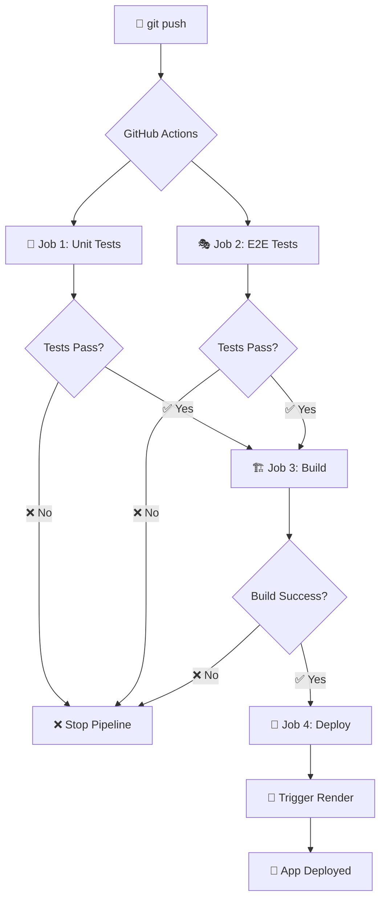

# 📊 Pipeline CI/CD - POV Review

## 🎯 Flujo del Pipeline



---

## 🔄 Jobs del Pipeline

### Job 1: 🧪 Unit Tests (Jest)
**Duración:** ~1-2 segundos  
**Propósito:** Ejecutar 95 tests unitarios

```bash
bun test
```

**Tests ejecutados:**
- ✅ 23 test suites
- ✅ 95 tests unitarios
- ✅ Cobertura de servicios, componentes, stores y hooks

**Si falla:** 
- ❌ Pipeline se detiene
- 🚫 No se ejecutan los demás jobs
- 📧 Notificación en GitHub

---

### Job 2: 🎭 E2E Tests (Playwright)
**Duración:** ~7-10 segundos  
**Propósito:** Ejecutar 31 tests end-to-end

```bash
bun run test:e2e
```

**Tests ejecutados:**
- ✅ Login y Register flows
- ✅ Movies CRUD operations
- ✅ Reviews management
- ✅ Dashboard admin features

**Características:**
- 🌐 Levanta servidor Next.js automáticamente
- 🤖 Instala Chromium para tests
- 📊 Genera reporte HTML
- 📤 Sube reporte como artifact (disponible 7 días)

**Si falla:**
- ❌ Pipeline se detiene
- 🚫 No se hace build ni deploy
- 📊 Reporte disponible en Artifacts

---

### Job 3: 🏗️ Build
**Duración:** ~20-30 segundos  
**Propósito:** Construir aplicación Next.js para producción

```bash
bun run build
```

**Requisitos:**
- ✅ Job 1 (Unit Tests) debe pasar
- ✅ Job 2 (E2E Tests) debe pasar

**Proceso:**
1. Instala dependencias con Bun
2. Compila TypeScript
3. Optimiza assets
4. Genera build de producción

**Si falla:**
- ❌ Pipeline se detiene
- 🚫 No se despliega
- 🔍 Revisa logs para errores de compilación

---

### Job 4: 🚀 Deploy to Render
**Duración:** ~5-10 minutos (en Render)  
**Propósito:** Desplegar automáticamente a Render

**Condiciones:**
- ✅ Solo en branch `main`
- ✅ Solo en `push` (no en pull requests)
- ✅ Todos los tests deben pasar
- ✅ Build debe ser exitoso

**Proceso:**
1. Llama al Deploy Hook de Render vía curl
2. Render recibe la señal
3. Render ejecuta:
   ```bash
   bun install
   bun run build
   bun start
   ```
4. App actualizada en: https://pov-review-front.onrender.com

---

## 📈 Estadísticas del Pipeline

| Métrica | Valor |
|---------|-------|
| **Total Jobs** | 4 |
| **Tests Unitarios** | 95 |
| **Tests E2E** | 31 |
| **Total Tests** | 126 |
| **Tiempo Estimado** | ~2-3 minutos |
| **Deploy Time** | +5-10 min (Render) |

---

## 🎯 Garantías de Calidad

✅ **100% de tests ejecutados antes de deploy**
- No se puede desplegar código roto
- Tests unitarios validan lógica
- Tests E2E validan flows completos

✅ **Build verificado**
- Errores de TypeScript detectados
- Optimizaciones aplicadas
- Validación de producción

✅ **Deploy automático**
- Solo en main
- Solo si todo pasa
- Sin intervención manual

---

## 🔍 Cómo Ver los Resultados

### En GitHub:
1. Ve a: https://github.com/Juanpapb0401/POV-REVIEW-FRONT/actions
2. Selecciona el workflow más reciente
3. Verás el estado de cada job:
   - 🧪 Unit Tests
   - 🎭 E2E Tests  
   - 🏗️ Build
   - 🚀 Deploy

### Artifacts (Reportes):
- Click en un workflow completado
- Busca "Artifacts" al final
- Descarga `playwright-report` para ver el reporte HTML de E2E

### En Render:
- https://dashboard.render.com
- Selecciona tu servicio
- Ve la pestaña "Logs" para ver el despliegue en tiempo real

---

## 🚨 Troubleshooting

### ❌ Unit Tests Fallan
```bash
# Ejecutar localmente para debug
bun test

# Ver tests específicos
bun test --watch
```

### ❌ E2E Tests Fallan
```bash
# Ejecutar localmente
bun run test:e2e

# Modo UI para debug
bun run test:e2e:ui

# Ver último reporte
bunx playwright show-report
```

### ❌ Build Falla
```bash
# Verificar localmente
bun run build

# Revisar errores de TypeScript
bun run lint
```

### ❌ Deploy Falla
1. Verifica que el secret `RENDER_DEPLOY_HOOK_URL` esté configurado
2. Verifica que el Deploy Hook sea válido en Render
3. Revisa logs en Render dashboard

---

## 🎬 Workflow Completo

```bash
# Developer
git add .
git commit -m "Feature: nueva funcionalidad"
git push origin main

# GitHub Actions (2-3 min)
→ 🧪 Run 95 unit tests       ✅
→ 🎭 Run 31 E2E tests        ✅  
→ 🏗️ Build Next.js app       ✅
→ 🚀 Trigger Render deploy   ✅

# Render (5-10 min)
→ Install dependencies
→ Build application
→ Start server
→ ✅ Live at: https://pov-review-front.onrender.com
```

---

## ✅ Cumplimiento del Taller

Este pipeline cumple con el **10% de Despliegue** requerido:

✅ **Pipeline CI/CD implementado**
✅ **Tests ejecutados automáticamente** (unitarios + E2E)
✅ **Despliegue automático** a Render
✅ **Build verificado** antes de deploy
✅ **Proceso documentado**

---

**Última actualización:** Noviembre 16, 2025
